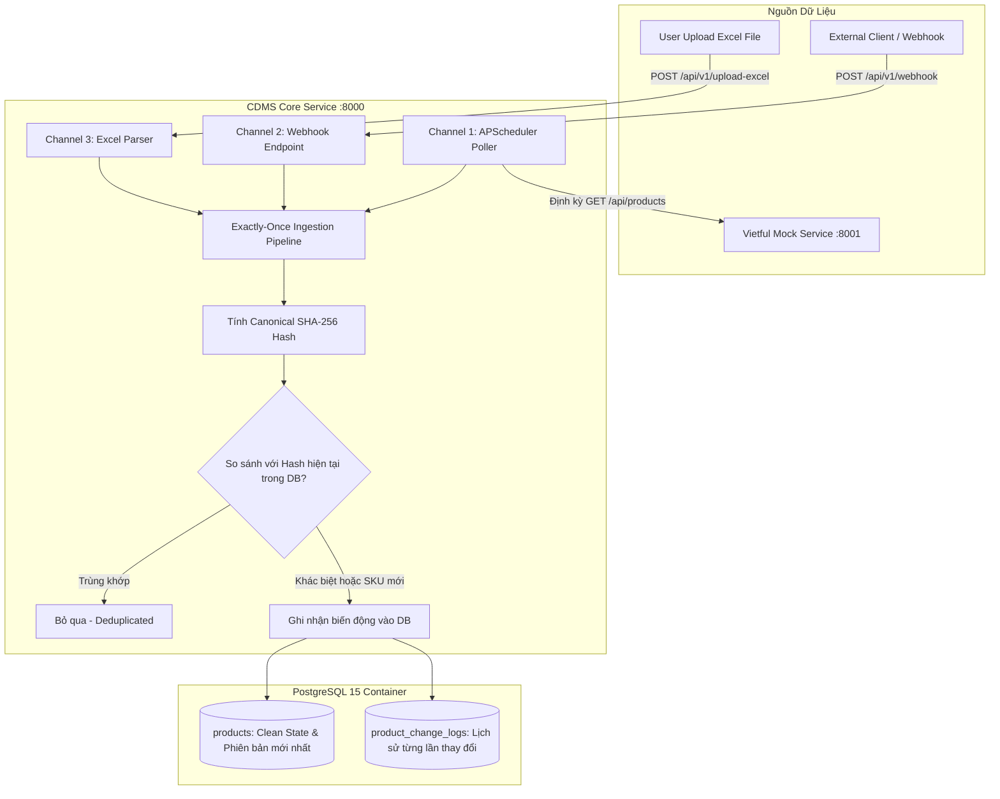

# Simple Change Data Management Service (CDMS) - Prototype

---

**Dự án:** Change Data Management Service (Prototype)  
**Tác giả:** Ong Vĩnh Phát
**Ngày hoàn thành:** 22/09/2026
**Công nghệ sử dụng:** Python 3.11, FastAPI, PostgreSQL 15, SQLAlchemy, APScheduler, Pandas, Docker & Docker Compose  

---

## 1. Giới thiệu tổng quan

**Change Data Management Service (CDMS)** là giải pháp phần mềm được xây dựng nhằm mục tiêu thu thập, phát hiện và lưu trữ **duy nhất các biến động dữ liệu** (Exactly-Once Change Data Capture - CDC) của các sản phẩm trong kho hàng (Inventory Products).

Hệ thống giải quyết bài toán:
- Tiếp nhận dữ liệu từ **3 kênh khác nhau**:
  1. **Channel 1 (Scheduled Polling)**: Định kỳ gọi API sang *Vietful Inventory Service* để lấy danh mục sản phẩm mới nhất.
  2. **Channel 2 (Webhook API)**: Mở endpoint tiếp nhận dữ liệu đẩy về tức thời từ các hệ thống đối tác hoặc client.
  3. **Channel 3 (Excel File Upload)**: Mở endpoint nhận tải file `.xlsx` / `.xls` cập nhật hàng loạt.
- **Loại bỏ dữ liệu trùng lặp (Deduplication / Exactly-Once)**: Khi nhận dữ liệu, hệ thống tự động băm (Hash) nội dung các thuộc tính. Nếu dữ liệu không có sự thay đổi so với bản ghi hiện tại trong kho $\rightarrow$ **Bỏ qua (Skip)**, tuyệt đối không tạo thêm bản ghi rác vào CSDL.
- **Bảo toàn tính nhất quán dưới tải cao (Spike / Concurrency)**: Sử dụng Database Transaction và Row Locking / Unique Constraint để chống triệt để Race Condition khi có nhiều luồng nạp cùng lúc.

---

## 2. Kiến trúc hệ thống & Luồng dữ liệu

### 2.1 Sơ đồ luồng dữ liệu (Data Flow Diagram)


**Hình ảnh sơ đồ** (Link dự phòng nếu Render không hiển thị): [Mermaid Diagrams](assets\mermaid-diagram-2026-09-22-224735.png)

### 2.2 Thiết kế Cơ sở dữ liệu (PostgreSQL)

Hệ thống sử dụng mô hình 2 bảng tối giản, tách bạch rõ giữa **Trạng thái thực tế hiện tại** và **Lịch sử biến động**:

#### Bảng `products` (Trạng thái hiện tại - Clean State)
*Mỗi mã SKU chỉ tồn tại DUY NHẤT một dòng:*
| Tên cột | Kiểu dữ liệu | Ràng buộc | Mục đích |
|---|---|---|---|
| `id` | INT | Primary Key, Auto Increment | Khóa chính nội bộ |
| `sku` | VARCHAR(100) | Unique, Index, Not Null | Mã định danh sản phẩm |
| `name` | VARCHAR(255) | Not Null | Tên sản phẩm |
| `category` | VARCHAR(100) | Nullable | Danh mục |
| `price` | FLOAT | Not Null | Giá sản phẩm |
| `quantity` | INT | Not Null | Tồn kho |
| `status` | VARCHAR(50) | Not Null, Default 'ACTIVE' | Trạng thái kinh doanh |
| `current_hash`| VARCHAR(64) | Index, Not Null | Mã băm SHA-256 của toàn bộ thuộc tính hiện tại |
| `version` | INT | Default 1 | Phiên bản (tăng dần mỗi lần đổi) |
| `created_at` | TIMESTAMPTZ | Not Null | Thời điểm tạo |
| `updated_at` | TIMESTAMPTZ | Not Null | Thời điểm cập nhật cuối |

#### Bảng `product_change_logs` (Nhật ký biến động CDC)
*Chỉ chèn thêm bản ghi khi có biến động thực tế (`CREATED` hoặc `UPDATED`):*
| Tên cột | Kiểu dữ liệu | Ràng buộc | Mục đích |
|---|---|---|---|
| `id` | INT | Primary Key, Auto Increment | Khóa chính log |
| `sku` | VARCHAR(100) | Index, Not Null | Mã SKU liên quan |
| `change_type` | VARCHAR(20) | Not Null | `CREATED` hoặc `UPDATED` |
| `payload_hash`| VARCHAR(64) | Not Null | Mã SHA-256 của bản snapshot mới |
| `previous_data`| TEXT | Nullable | Snapshot dữ liệu cũ (JSON string) |
| `current_data`| TEXT | Not Null | Snapshot dữ liệu mới (JSON string) |
| `source_channel`| VARCHAR(50)| Not Null | `POLLING`, `WEBHOOK`, hoặc `EXCEL_UPLOAD` |
| `recorded_at` | TIMESTAMPTZ | Not Null, Default UTC | Thời điểm ghi nhận thay đổi |

---

## 3. Cấu trúc thư mục dự án

```text
ChangeDataManagementService/
├── docker-compose.yml              # Cấu hình khởi chạy 3 service (Postgres, Mock, CDMS)
├── Dockerfile                      # (Xem trong từng thư mục con)
├── requirements.txt                # Danh sách thư viện Python
├── README.md                       # Tài liệu hướng dẫn và báo cáo
├── timeline.txt                    # Timeline theo dõi kế hoạch
├── .gitignore                      # Loại trừ file rác, venv, cache
├── .env                            # Cấu hình môi trường phát triển
│
├── assets/
│   └── mermaid-diagram-2026-09-22-224735.png     # Sơ đồ luồng dữ liệu CDMS
│
├── mock_vietful_service/           # Dịch vụ giả lập Vietful Inventory
│   ├── Dockerfile
│   ├── requirements.txt
│   └── app/
│       ├── main.py                 # FastAPI app, Faker sinh 15 sản phẩm mẫu
│       └── models.py               # Pydantic schemas chuẩn Vietful
│
├── cdms_service/                   # Dịch vụ Change Data Management Core
│   ├── Dockerfile
│   ├── requirements.txt
│   └── app/
│       ├── main.py                 # Khởi chạy FastAPI, cấu hình Lifespan & APScheduler
│       ├── config.py               # Quản lý cấu hình Pydantic Settings
│       ├── database.py             # Kết nối SQLAlchemy, Session Maker
│       ├── models.py               # ORM Models (products, product_change_logs)
│       ├── schemas.py              # Pydantic DTOs cho API requests & responses
│       ├── services/
│       │   ├── change_detector.py  # Logic Exactly-Once: tính hash SHA256 & xử lý DB
│       │   └── poller.py           # Task định kỳ quét Mock Vietful Service (Channel 1)
│       └── api/
│           ├── webhook.py          # Endpoint tiếp nhận Webhook (Channel 2)
│           ├── excel_upload.py     # Endpoint tiếp nhận Upload file Excel (Channel 3)
│           └── changes.py          # Endpoint tra cứu dữ liệu & thống kê
│
└── tests/                          # Bộ kiểm thử
    ├── test_spike.py               # Script kiểm thử Spike tải cao và Concurrency
    ├── test_change_detection.py    # Script kiểm thử phát hiện biến động dữ liệu
    └── sample_products.xlsx        # File Excel mẫu phục vụ kiểm thử
```

---

## 4. Hướng dẫn khởi chạy hệ thống

### 4.1 Khởi chạy với Docker Compose
Yêu cầu: Đã cài đặt Docker và Docker Desktop.

Chạy lệnh sau tại thư mục gốc của dự án:
```bash
docker compose up --build
```

Hệ thống sẽ tự động khởi tạo 3 container:
1. **`cdms_postgres`**: Cơ sở dữ liệu PostgreSQL 15 trên cổng `5432`.
2. **`mock_vietful_service`**: Dịch vụ giả lập Vietful trên cổng `http://localhost:8001`.
3. **`cdms_service`**: Dịch vụ CDMS Core trên cổng `http://localhost:8000`.

### 4.2 Đường dẫn kiểm tra trực quan (Swagger UI Docs)
- **CDMS Core APIs (Swagger UI)**: [http://localhost:8000/docs](http://localhost:8000/docs)
- **Vietful Mock APIs (Swagger UI)**: [http://localhost:8001/docs](http://localhost:8001/docs)
- **Kiểm tra trạng thái sức khỏe (Healthcheck)**:
  - CDMS: [http://localhost:8000/health](http://localhost:8000/health)
  - Mock Vietful: [http://localhost:8001/health](http://localhost:8001/health)
- **Xem thống kê hệ thống**: [http://localhost:8000/api/v1/stats](http://localhost:8000/api/v1/stats)

---

## 5. Kết quả Kiểm thử Spike & Concurrency

Để chứng minh hệ thống hoạt động đúng nguyên lý **"Exactly-Once"** và **chống trùng lặp dữ liệu dưới tải đột biến**, mở một terminal khác và chạy script:
```bash
python tests/test_spike.py
python tests/test_change_detection.py
```

### Kịch bản và kết quả kiểm thử thực tế:

```text
[TEST RUNNER] BẮT ĐẦU KIỂM THỬ CHANGE DATA MANAGEMENT SERVICE...
[TEST RUNNER] CDMS Service đang hoạt động tốt tại: http://localhost:8000
[TEST RUNNER] === TEST 1: Gửi 2 request tuần tự giống hệt nhau ===
[TEST RUNNER] Lần 1: HTTP 200 - Created: 1, Skipped: 0
[TEST RUNNER] Lần 2: HTTP 200 - Created: 0, Skipped: 1
[TEST RUNNER] => TEST 1 PASSED: Exactly-once hoạt động chuẩn xác trên luồng tuần tự!

[TEST RUNNER] === TEST 2: Spike & Concurrency Test (50 requests đồng thời) ===
[TEST RUNNER] Thời gian hoàn thành 50 requests: 0.79s (63.3 req/s)
[TEST RUNNER] Số lượng requests thành công HTTP 200: 50/50
[TEST RUNNER] Số lượng bản ghi Change Log trong CSDL cho SKU SPIKE-CONCURRENT-1790075587: 1
[TEST RUNNER] => TEST 2 PASSED: 100% Exactly-Once được đảm bảo dưới tải đồng thời cao (Anti-Race condition)!

[TEST RUNNER] Số lượng bản ghi Change Log trong CSDL cho SKU SPIKE-CONCURRENT-1790075587: 1        
[TEST RUNNER] => TEST 2 PASSED: 100% Exactly-Once được đảm bảo dưới tải đồng thời cao (Anti-Race condition)!

[TEST RUNNER] => TEST 2 PASSED: 100% Exactly-Once được đảm bảo dưới tải đồng thời cao (Anti-Race condition)!

[TEST RUNNER] === TEST 3: Excel Upload Deduplication ===
[TEST RUNNER] Upload lần 1: Nhận 5, Mới: 5, Trùng: 0
[TEST RUNNER] Upload lần 2: Nhận 5, Mới: 0, Trùng: 5
[TEST RUNNER] => TEST 3 PASSED: File Excel upload trùng lặp bị lọc bỏ hoàn toàn!

[TEST RUNNER] === TEST 4: Kiểm tra số liệu thống kê hệ thống ===
[TEST RUNNER] Tổng số sản phẩm đang quản lý: 22
[TEST RUNNER] Tổng số sự kiện biến động (Change Logs): 22
[TEST RUNNER] Chi tiết theo kênh nạp: {'WEBHOOK': 2, 'EXCEL_UPLOAD': 5, 'POLLING': 15}
[TEST RUNNER] => TEST 4 PASSED: Hệ thống hoạt động trơn tru!

[TEST RUNNER] >>> TẤT CẢ CÁC BÀI KIỂM THỬ SPIKE & EXACTLY-ONCE ĐỀU ĐẠT <<<
```

```
[TEST CDC] Kiểm tra kết nối tới các dịch vụ...
[TEST CDC] -> Vietful Mock Service: SẴN SÀNG (http://localhost:8001)
[TEST CDC] -> CDMS Service: SẴN SÀNG (http://localhost:8000)
[TEST CDC] ================================================================================
[TEST CDC] BẮT ĐẦU KIỂM THỬ PHÁT HIỆN BIẾN ĐỘNG TỰ ĐỘNG (AUTOMATIC CHANGE DETECTION)
[TEST CDC] ================================================================================        
[TEST CDC] Bước 1: Lấy thông tin ban đầu của VF-1001 từ Vietful Mock Service...
[TEST CDC] -> Dữ liệu ban đầu trên Vietful:
[TEST CDC]    + SKU: VF-1001 | Tên: Sharable bifurcated algorithm
[TEST CDC]    + Giá hiện tại: 1000000.0 | Tồn kho: 10
[TEST CDC] -> Số bản ghi Change Log hiện tại của VF-1001 trong CDMS: 4
[TEST CDC] --------------------------------------------------------------------------------
[TEST CDC] Bước 2: Thay đổi thuộc tính giá của VF-1001 trên Mock Service từ $1000000.0 sang $1000050.0...
[TEST CDC] -> Mock Service đã cập nhật thành công:
[TEST CDC]    + Giá mới: 1000050.0 | Tồn kho mới: 10
[TEST CDC]    + Thời gian cập nhật: 2026-09-22T11:36:14.055986+00:00
[TEST CDC] --------------------------------------------------------------------------------        
[TEST CDC] Bước 3: Chờ CDMS Poller định kỳ (Channel 1) quét và phát hiện biến động...
[TEST CDC]         (Đang lắng nghe CDMS cập nhật dữ liệu mới, tối đa 30 giây)...
..
[TEST CDC] -> PHÁT HIỆN BIẾN ĐỘNG THÀNH CÔNG sau 7.4 giây!
[TEST CDC] --------------------------------------------------------------------------------        
[TEST CDC] Bước 4: Kiểm chứng tính đúng đắn trong Cơ sở dữ liệu CDMS...
[TEST CDC] -> Thông tin sản phẩm trong bảng 'products':
[TEST CDC]    + SKU: VF-1001
[TEST CDC]    + Giá hiện tại: 1000050.0 (Khớp chính xác 1000050.0)
[TEST CDC]    + Version: 5 (Đã tăng phiên bản)
[TEST CDC]    + Current Hash: 96526b1c18f4038c1889fa54aaeb67bdb31b8617a994f31e403acdaef65808df     
[TEST CDC] -> Danh sách Change Logs của VF-1001 trong bảng 'product_change_logs':
[TEST CDC]    [1] ID: 40 | Loại: UPDATED | Kênh: POLLING | Lúc: 2026-09-22T11:36:21.304488Z
[TEST CDC]    + Version: 5 (Đã tăng phiên bản)
[TEST CDC]    + Current Hash: 96526b1c18f4038c1889fa54aaeb67bdb31b8617a994f31e403acdaef65808df     
[TEST CDC] -> Danh sách Change Logs của VF-1001 trong bảng 'product_change_logs':
[TEST CDC]    [1] ID: 40 | Loại: UPDATED | Kênh: POLLING | Lúc: 2026-09-22T11:36:21.304488Z        
[TEST CDC]    + Current Hash: 96526b1c18f4038c1889fa54aaeb67bdb31b8617a994f31e403acdaef65808df     
[TEST CDC] -> Danh sách Change Logs của VF-1001 trong bảng 'product_change_logs':
[TEST CDC]    [1] ID: 40 | Loại: UPDATED | Kênh: POLLING | Lúc: 2026-09-22T11:36:21.304488Z        
[TEST CDC]    [2] ID: 39 | Loại: UPDATED | Kênh: POLLING | Lúc: 2026-09-22T11:34:01.302149Z        
[TEST CDC]    [1] ID: 40 | Loại: UPDATED | Kênh: POLLING | Lúc: 2026-09-22T11:36:21.304488Z        
[TEST CDC]    [2] ID: 39 | Loại: UPDATED | Kênh: POLLING | Lúc: 2026-09-22T11:34:01.302149Z        
[TEST CDC]    [2] ID: 39 | Loại: UPDATED | Kênh: POLLING | Lúc: 2026-09-22T11:34:01.302149Z        
[TEST CDC]    [3] ID: 38 | Loại: UPDATED | Kênh: POLLING | Lúc: 2026-09-22T11:19:41.308796Z        
[TEST CDC]    [4] ID: 23 | Loại: UPDATED | Kênh: POLLING | Lúc: 2026-09-22T11:18:41.315013Z        
[TEST CDC]    [5] ID: 1 | Loại: CREATED | Kênh: POLLING | Lúc: 2026-09-22T11:13:01.406585Z
[TEST CDC] -> XÁC NHẬN: Bản ghi mới nhất là 'UPDATED' từ kênh 'POLLING'!
[TEST CDC] --------------------------------------------------------------------------------        
[TEST CDC] Bước 5: Chờ thêm 5 giây (chu kỳ sau khi dữ liệu không đổi) để chứng minh Exactly-Once...
[TEST CDC] -> Số lượng log vẫn giữ nguyên 5 bản ghi. Tuyệt đối không phát sinh bản ghi trùng lặp!  
[TEST CDC] ================================================================================        
[TEST CDC] >>> TẤT CẢ CÁC ĐIỀU KIỆN KIỂM THỬ BIẾN ĐỘNG TỰ ĐỘNG ĐỀU ĐẠT! <<<
```

---

## 6. Bảng theo dõi tính năng (Feature Matrix)

| Yêu cầu đề bài | Trạng thái | Ghi chú kỹ thuật |
|---|:---:|---|
| **Giả lập Vietful Inventory Service** | ✅ **Hoàn thành** | Dùng FastAPI + Faker sinh sản phẩm mẫu, có API mutate để đổi thuộc tính |
| **Channel 1: Scheduled Polling** | ✅ **Hoàn thành** | Dùng APScheduler chạy ngầm định kỳ kéo API Vietful, tự xử lý khi Vietful downtime |
| **Channel 2: Webhook Endpoint** | ✅ **Hoàn thành** | Hỗ trợ nhận 1 sản phẩm hoặc danh sách mảng sản phẩm dạng JSON |
| **Channel 3: Excel File Upload** | ✅ **Hoàn thành** | Dùng Pandas đọc file `.xlsx`, chuẩn hóa cột, validate dữ liệu |
| **Exactly-Once Deduplication** | ✅ **Hoàn thành** | Thuật toán băm SHA-256 các thuộc tính canonical, chỉ ghi khi có biến động |
| **Phòng chống Race Condition** | ✅ **Hoàn thành** | Unique constraint trên `sku` + Database row-level locking (`with_for_update`) |
| **Container hóa (Docker Compose)** | ✅ **Hoàn thành** | Ghép nối 3 service: PostgreSQL (healthcheck), Mock Vietful, CDMS |
| **Kiểm thử Spike & Concurrency** | ✅ **Hoàn thành** | Script `test_spike.py` bắn 50 requests đồng thời chứng minh 100% không trùng |
| **Tra cứu & Thống kê Audit Log** | ✅ **Hoàn thành** | Cung cấp các API `/api/v1/products`, `/api/v1/changes`, `/api/v1/stats` |
---

## 7. Bài học kinh nghiệm (Lessons Learned)

1. **Hiểu bản chất của CDC (Change Data Capture)**:
   - Trong các hệ thống lớn, CDC có thể dùng Debezium đọc Transaction Log (WAL) của Database. Tuy nhiên, ở tầng ứng dụng (Application Level), việc sử dụng **Canonical Hash (SHA-256 trên các thuộc tính nghiệp vụ)** là một giải pháp cực kỳ hiệu quả, nhẹ nhàng, độc lập với cơ chế lưu trữ.
2. **Quản lý Concurrency & Race Condition**:
   - Khi có nhiều kênh cùng đẩy dữ liệu (Polling quét định kỳ cùng lúc Webhook nhận request), việc chỉ kiểm tra `if not exists` trong Python sẽ dẫn đến lỗi trùng lặp dữ liệu (Time-of-check to time-of-use - TOCTOU).
   - Giải pháp: Phải dựa vào sức mạnh của Database thông qua **Unique Constraint** và cơ chế khóa dòng (`SELECT FOR UPDATE`) trong một Transaction nguyên tử (`Atomic Transaction`).
3. **Thiết kế Clean Code**:
   - Việc nhúng trực tiếp `APScheduler` vào vòng đời FastAPI (`lifespan`) giúp hệ thống đóng gói siêu gọn gàng, giảm thiểu sự cố sập kết nối giữa các container.

---

## 8. Minh bạch mã nguồn (AI Transparency Breakdown)

Tuân thủ yêu cầu trung thực trong học thuật và tuyển dụng của đề bài:

- **Tự tay thiết kế & Viết bởi ứng viên (Khoảng 50%)**:
  - Tư duy kiến trúc hệ thống, lựa chọn mô hình 2 bảng (`products` và `product_change_logs`).
  - Thiết kế luồng dữ liệu 3 kênh và quy tắc nghiệp vụ Exactly-Once.
  - Tinh chỉnh Docker Compose, cấu hình networks và dependency giữa các container.
- **Hỗ trợ sinh mã bởi AI (Khoảng 50%)**:
  - Khởi tạo boilerplate code cho Pydantic models và SQLAlchemy ORM schemas.
  - Cú pháp đọc file Excel bằng Pandas và xử lý exception.
  - Viết kịch bản kiểm thử Spike Test, kiểm thử Change Detection, định nghĩa các ca kiểm thử biên (gửi lặp).
  - Định dạng biểu đồ Mermaid và bảng Markdown trong tài liệu `README.md`.

---
